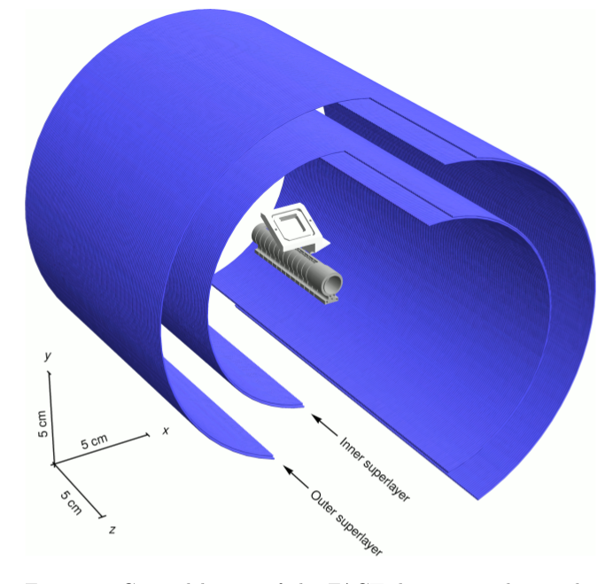
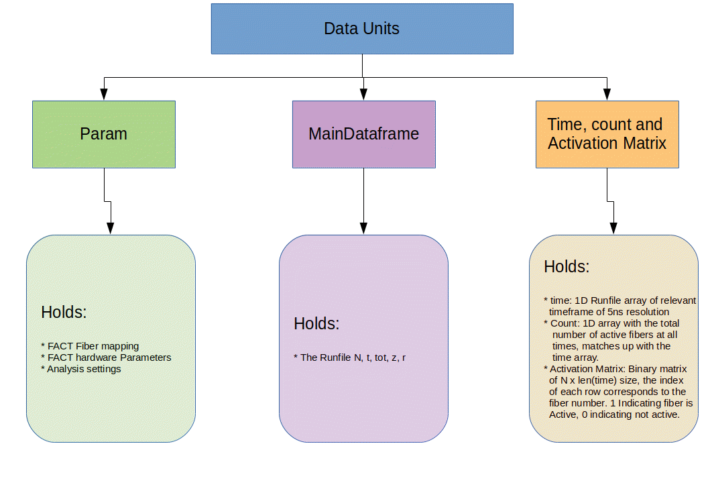
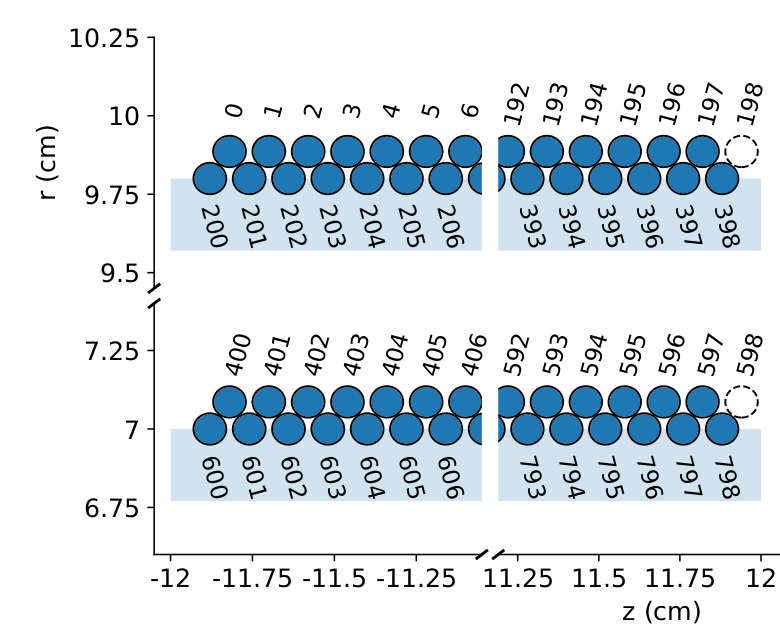
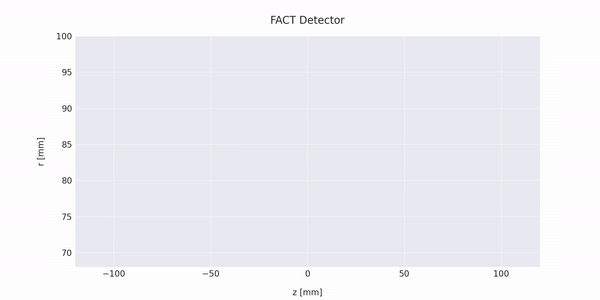

# FACTAS -   Fast Annihilation Cryogenic Tracker Analysis Software

The Fast Annihilation Cryogenic Tracker (FACT) detector aims to demonstrate the production of antihydrogen, as a step on the way towards performing a gravity measurment of antihydrogen by the AEgIS collaboration. This directory is the working directory for developing softwear for analysis on the ROOT-files that the detector is putting out. The package reads the ROOT files from a local drive linked under /Data/, and runs analysis either on single or multiple data files. The analysis is then displayed with several visualization modules, as described in further detail down below. 

   

  
   <figcaption>Fig.1 - Illustration of FACT. Purple area - 4 scintillating fiber layers, 2 superlayers consisting of two sublayers. Gray area - Penning-Malmberg trap. The cut out is just for illustration, and not a part of the physical illustration</figcaption>

   

_Intention:_ This package intends to provide easy access to the FACT data, as it is streamed directly from the detector into the Data directory. This will make it easier to check that everything runs as it should, and to perform easy analysis on top of the data.

_Future Development:_ The softwear is currently in it's initial phases of development, where the basic functionalities are implemented. Like for instance clustering algorithms and vertex reconstructions. Further development entails building a solid GUI system, exec systems and a wider range of visualization tools. One also has to develop a simple way to easily implement any physical changes on the detector. 

## Installation

The package will at a later time be wrapped as an executable, and run through a user interface. 
As of now the program runs in a virtual environment directly through src/main.py.

### Setting up the Virtual Environment
To set up the virtual environment please run from main dir

    ../LivePlotting$: pipenv install
    ../LivePlotting$: pipenv shell 
    ../LivePlotting$: pip install -r requirements.txt
  

### Usage
Running from main.py:
    
    ../LivePlotting$: pipenv shell
    ../LivePlotting/src$: python3 main.py

### Running Unit Tests
Run Unit Testing by either running 

    ../LivePlotting/src/src_UnitTesting/$: test_<Class>.py
    ../LivePlotting/src/src_UnitTesting/$: test_SetUp.py

or by running the modules directly

    ../LivePlotting/src/src_<module>$: <module>.py
    ../LivePlotting/src/src_SetUp$: SetUp.py

# Build

    Data_Example:
          Contains one example file that can be run from /Data/
    
    Documentation:
          Contains documentation files - settings.pdf (Parameter description)
    
    Images:
          Display examples of vizualization modules, figures and illustrations of physics
        
    settings: 
          settings.txt Contains all physical parameters of the detector. The parameters are described in a separate file under Documentation - settings.pdf
        
    src:        
          Source code of the program. 

        
        

## FlowChart and FlowStructure

    Run through main.py.

*Main.py*: Performs three tasks. 
  1. Loads param, i.e. sets hardware parameters and configured analysisparameters as set in settings.txt. 
  2. Makes the desiered analysis modules as a call to either a single file or a multi-file analysis. 
  3. Makes final call to plotting and visualization modules.

*LoadSettings*: Loads the param unit from the settings.csv file. 

*RunAnalysis*: Contains initiator for Setup and Analysis. Allows for either running entire directories or singular files. 
Has two modules called RunSingleFileAnalysis and RunMultiFileAnalysis. RunSingleFileAnalysis builds a standard setup through the SetUp class and then calls to AnalysisToolBox [ATB]. When the ATB module Initiate_Standard_Analysis() is called a _standard_ analysis is performed, and a pandas DataFrame containing the vertex positions and weights are provided. When RunMultiFileAnalysis is called, a call is made to RunSingleFileAnalysis for each file in the directory. The information is then collected in a single large Dataframe containing the combined list of the vertices from all the individual files. !NB TO self: Single file analysis should just be another case of multifile analysis, remove this at a later time. 

*SetUp*: Clean up the Runfile and produce main data units, builds the Activation Matrix, builds composit database that links FACTMapper to runfile. Evaluates wheter the runfile is a calibration file.

*BuildEvents*: Finds a selected tail region of the runfile, locates clusters of events

*VertexReconstructor*: Takes the cluster information and tracks potential trajectories, performes an extrapolation to the vertex point of the z axis 

*plot*: stores methods for plotting and visualizations.

The program flowchart is presented in the figure below.

  
   <figcaption>Fig.2 - Softwear flowchart</figcaption>

## Main Information Holders
The analysis is run with three primary information holder structures. This data comes from two primeary sources, the first is the raw data put out by FACT, the second is the external input of physical detector parameters. 

1. *param:* Param is an instance of the class LoadData holding all the external parameters set in the file settings/settings.txt. Furthermore, the instance holds the coordinate mapping providing z and r coordinates of each singular fiber in the property param.CoordinateMatrix. 
        
2. *MainData:* Main data holds the raw data file containing the fiber activation information of fiber number N, activation timestamp t, and the time over threshold tot. During the SetUp.CombineDatabases() procedure, this main dataframe is expanded to include the r, z positioning of each fiber N. I.e. a DataFrame on the column format ['N', 't', 'tot', 'z', 'r'].

# FACT Basics

The honeycomb structure of the sublayers are illustrated in the figure below, as well as the FACT mapping. 

  
   <figcaption>Fig.3 - Illustration of the interior structure of FACT showing the outer edges of the four superlayers sorted in two superlayers.</figcaption>

## Raw Data Files
The FACT system produces raw datafiles on the following format. Eatch time a fiber fires off a signal is sent containing the information of the fiber number N, the time at which the fiber went off and the amount of time the fiber stayed on. 

| **N**   | **t** | **tot** |
|-----|---|-----|
| 412 | 0 | 5   |
| 5   | 5 | 15  |
| 200 | 5 | 10  |
...
| 645 | 35| 10  |

N: The unique fiber number yielding the coordinates z, r
t: The time stamp when a fiber fiers 
tot: The time the fiber stays activated after a fiber has fiered, proportional to the incoming energy of the fiber

# Visualization Output
This module is ment to be expanded upon to open up for more features. 

## OutPut Basics

For each Runfile the system has the ability to put out a direct stream of the fact detector going off, as illustrated in the figure below. 

  
   <figcaption>Fig.4 - </figcaption>

After running a multifile analysis collecting data from multiple runfiles the softwear presents a statistical overwiev of the origin  
Denote, the current results are subjected to a bug that needs reviewing, the following illustrations are only ment as an example on the type of data presented. 

## Issue/Project Management
-> GitKraken Boards

# Roadmap
Ideas for future development

# Authors and acknowledgment

## Contributors 
| **Name**   | **Contact** |
|-----|---|
| Oline A. Ranum | olinear@uio.no | 

## Support 
Primary developer: Oline Ranum - olinear@uio.no

# Project status
Early stages of development 
Working on building cornerstones of the system 

# Future TODOs':
 -> Build the connection between the detector and the _/Data/_ folder. 
